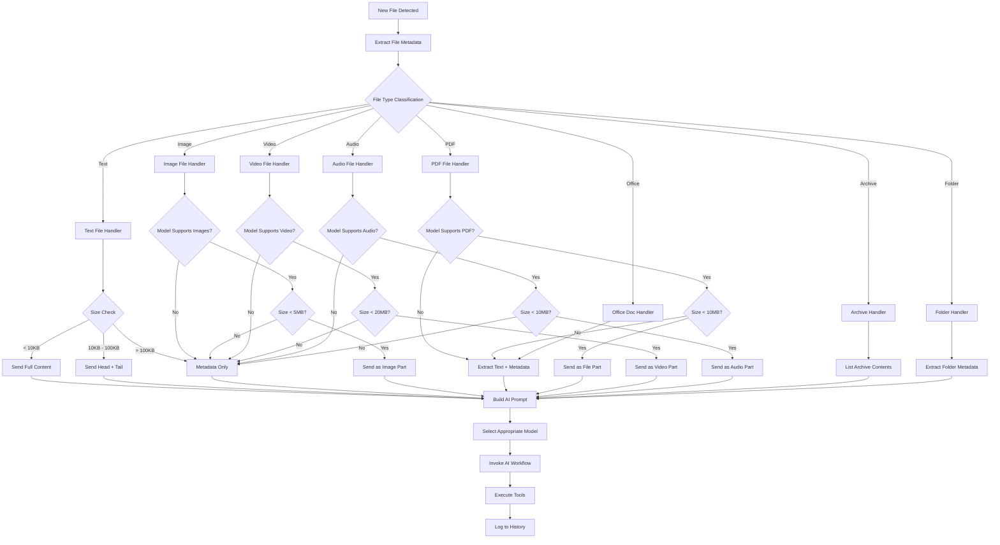
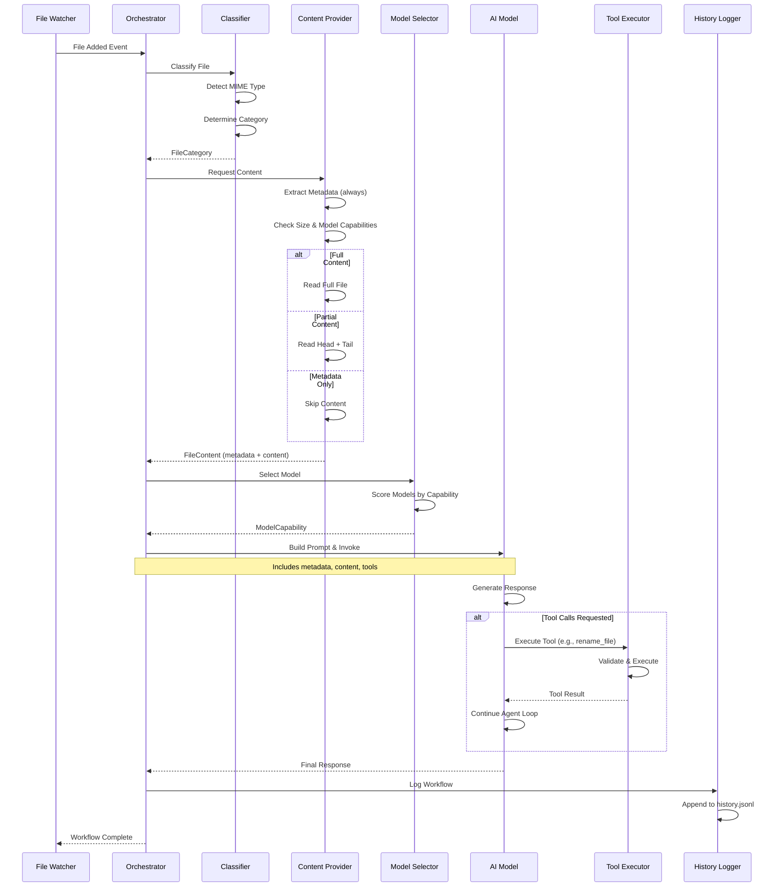

# SmartFolder Behavior Documentation

## Table of Contents
1. [Overview](#overview)
2. [File Routing Architecture](#file-routing-architecture)
3. [Model Capability Registry](#model-capability-registry)
4. [File Content Provider System](#file-content-provider-system)
5. [Metadata Extraction Pipeline](#metadata-extraction-pipeline)
6. [Workflow Lifecycle](#workflow-lifecycle)
7. [Configuration Behavior](#configuration-behavior)
8. [Use Cases](#use-cases)
9. [Design Patterns](#design-patterns)
10. [Cost Optimization](#cost-optimization)

---

## Overview

SmartFolder is a local CLI tool that watches folders and intelligently automates file organization using AI. The system uses a sophisticated routing architecture to determine how files are processed based on:

- **File type** (text, image, PDF, video, audio, archive, etc.)
- **File size** (small, medium, large thresholds)
- **AI model capabilities** (what each model can natively process)
- **Token usage costs** (optimization at scale)

### Core Principle: Metadata-First Architecture

**Every file gets metadata extraction** (always included in AI context), while **file content is optional** and can be:
- **Full content** - Entire file sent to AI
- **Partial content** - Head/tail truncation or sampling
- **No content** - Metadata-only (AI can request content via tools)

---

## File Routing Architecture

### High-Level Flow Diagram



### File Type Categories

| Category | Extensions | Binary? | Native Support By Model |
|----------|-----------|---------|------------------------|
| **Text Documents** | `.txt`, `.md`, `.log`, `.html`, `.css` | No | All models |
| **Code Files** | `.js`, `.py`, `.ts`, `.go`, `.rs`, `.java` | No | All models |
| **Structured Data** | `.json`, `.xml`, `.csv`, `.yaml`, `.toml` | No | All models |
| **Office Documents** | `.docx`, `.xlsx`, `.pptx`, `.doc`, `.xls`, `.ppt` | Yes | None (extract text) |
| **PDFs** | `.pdf` | Yes | GPT-4o-mini (native) |
| **Images** | `.jpg`, `.png`, `.gif`, `.webp`, `.svg`, `.bmp` | Yes | GPT-4o-mini, GPT-4.1-nano, Gemini 2.0 Flash |
| **Audio** | `.mp3`, `.wav`, `.ogg`, `.m4a`, `.flac` | Yes | Gemini 2.0 Flash only |
| **Video** | `.mp4`, `.avi`, `.mov`, `.webm`, `.mkv` | Yes | Gemini 2.0 Flash only |
| **Archives** | `.zip`, `.tar`, `.gz`, `.rar`, `.7z` | Yes | None (list contents) |

### Size Thresholds

```typescript
// Current implementation (hardcoded)
const TEXT_FILE_TRUNCATE_THRESHOLD = 10 * 1024;      // 10KB
const MAX_BINARY_FILE_SIZE = 20 * 1024 * 1024;       // 20MB
const MAX_READ_BYTES = 256 * 1024;                    // 256KB for tools

// Proposed configurable thresholds
const DEFAULT_THRESHOLDS = {
  text: {
    fullContentMax: 10 * 1024,        // 10KB - send full
    partialContentMax: 100 * 1024,     // 100KB - send head/tail
    metadataOnlyAbove: 100 * 1024,     // >100KB - metadata only
  },
  image: {
    fullContentMax: 5 * 1024 * 1024,   // 5MB
    metadataOnlyAbove: 5 * 1024 * 1024,
  },
  pdf: {
    fullContentMax: 10 * 1024 * 1024,  // 10MB
    metadataOnlyAbove: 10 * 1024 * 1024,
  },
  video: {
    fullContentMax: 20 * 1024 * 1024,  // 20MB
    metadataOnlyAbove: 20 * 1024 * 1024,
  },
  audio: {
    fullContentMax: 10 * 1024 * 1024,  // 10MB
    metadataOnlyAbove: 10 * 1024 * 1024,
  },
};
```

---

## Model Capability Registry

### Design Pattern: Strategy Pattern with Capability Declaration

Each AI model declares its capabilities, allowing the router to select the appropriate model and content strategy.

```typescript
// src/models/ModelCapability.ts
export interface ModelCapability {
  // Model identification
  modelId: string;
  provider: 'openai' | 'google' | 'anthropic' | 'custom';

  // Native support capabilities
  supportsText: boolean;
  supportsImages: boolean;
  supportsPDF: boolean;
  supportsAudio: boolean;
  supportsVideo: boolean;

  // Context limits
  maxInputTokens: number;
  maxOutputTokens: number;

  // Cost per million tokens
  costPerMillionInputTokens: number;
  costPerMillionOutputTokens: number;

  // Strengths (for auto-selection)
  strengths: ModelStrength[];

  // Optimal use cases
  bestFor: FileCategory[];
}

export enum ModelStrength {
  LARGE_CONTEXT = 'large_context',
  FAST_INFERENCE = 'fast_inference',
  COST_EFFECTIVE = 'cost_effective',
  IMAGE_ANALYSIS = 'image_analysis',
  VIDEO_ANALYSIS = 'video_analysis',
  AUDIO_ANALYSIS = 'audio_analysis',
  CODE_GENERATION = 'code_generation',
  STRUCTURED_OUTPUT = 'structured_output',
}

export enum FileCategory {
  TEXT_DOCUMENT = 'text_document',
  CODE_FILE = 'code_file',
  STRUCTURED_DATA = 'structured_data',
  IMAGE = 'image',
  PDF = 'pdf',
  AUDIO = 'audio',
  VIDEO = 'video',
  OFFICE_DOC = 'office_doc',
  ARCHIVE = 'archive',
  FOLDER = 'folder',
}
```

### Model Registry Implementation

```typescript
// src/models/registry.ts
export const MODEL_REGISTRY: Record<string, ModelCapability> = {
  'openai/gpt-4o-mini': {
    modelId: 'gpt-4o-mini',
    provider: 'openai',
    supportsText: true,
    supportsImages: true,
    supportsPDF: true,
    supportsAudio: false,
    supportsVideo: false,
    maxInputTokens: 128_000,
    maxOutputTokens: 16_384,
    costPerMillionInputTokens: 0.15,
    costPerMillionOutputTokens: 0.60,
    strengths: [
      ModelStrength.COST_EFFECTIVE,
      ModelStrength.IMAGE_ANALYSIS,
      ModelStrength.FAST_INFERENCE,
    ],
    bestFor: [
      FileCategory.TEXT_DOCUMENT,
      FileCategory.IMAGE,
      FileCategory.PDF,
      FileCategory.CODE_FILE,
    ],
  },

  'openai/gpt-4.1-nano': {
    modelId: 'gpt-4.1-nano',
    provider: 'openai',
    supportsText: true,
    supportsImages: true,
    supportsPDF: false,
    supportsAudio: false,
    supportsVideo: false,
    maxInputTokens: 1_000_000,
    maxOutputTokens: 16_384,
    costPerMillionInputTokens: 0.10,
    costPerMillionOutputTokens: 0.40,
    strengths: [
      ModelStrength.LARGE_CONTEXT,
      ModelStrength.COST_EFFECTIVE,
      ModelStrength.FAST_INFERENCE,
    ],
    bestFor: [
      FileCategory.TEXT_DOCUMENT,
      FileCategory.CODE_FILE,
      FileCategory.STRUCTURED_DATA,
    ],
  },

  'google/gemini-2.0-flash-exp': {
    modelId: 'gemini-2.0-flash-exp',
    provider: 'google',
    supportsText: true,
    supportsImages: true,
    supportsPDF: false,
    supportsAudio: true,
    supportsVideo: true,
    maxInputTokens: 1_000_000,
    maxOutputTokens: 8_192,
    costPerMillionInputTokens: 0.075,
    costPerMillionOutputTokens: 0.30,
    strengths: [
      ModelStrength.VIDEO_ANALYSIS,
      ModelStrength.AUDIO_ANALYSIS,
      ModelStrength.FAST_INFERENCE,
      ModelStrength.LARGE_CONTEXT,
    ],
    bestFor: [
      FileCategory.VIDEO,
      FileCategory.AUDIO,
      FileCategory.IMAGE,
    ],
  },
};

// Model selection logic
export function selectModelForFile(
  fileCategory: FileCategory,
  fileSize: number,
  userPreference?: string
): ModelCapability {
  if (userPreference && MODEL_REGISTRY[userPreference]) {
    return MODEL_REGISTRY[userPreference];
  }

  // Auto-select based on file type
  const candidates = Object.values(MODEL_REGISTRY).filter(model =>
    model.bestFor.includes(fileCategory)
  );

  // Score models based on capabilities and cost
  const scored = candidates.map(model => {
    let score = 0;

    // Prefer native support
    if (fileCategory === FileCategory.VIDEO && model.supportsVideo) score += 100;
    if (fileCategory === FileCategory.AUDIO && model.supportsAudio) score += 100;
    if (fileCategory === FileCategory.PDF && model.supportsPDF) score += 50;
    if (fileCategory === FileCategory.IMAGE && model.supportsImages) score += 50;

    // Prefer lower cost
    score += (1 / model.costPerMillionInputTokens) * 10;

    // Prefer large context for big files
    if (fileSize > 50_000 && model.maxInputTokens > 500_000) score += 20;

    return { model, score };
  });

  // Sort by score descending
  scored.sort((a, b) => b.score - a.score);

  return scored[0]?.model || MODEL_REGISTRY['openai/gpt-4o-mini'];
}
```

### Using Vercel AI SDK v6 with Model Strings

In AI SDK v6, you simply pass the model string directly - **no provider imports needed!**

```typescript
// src/workflow/aiClient.ts
import { generateText } from 'ai';

// Just pass the model string directly
const result = await generateText({
  model: 'openai/gpt-4o-mini',  // AI SDK v6 handles provider routing automatically
  apiKey: apiKey,
  system: systemPrompt,
  prompt: userPrompt,
  tools: tools,
});
```

**Model Selection Based on File Type:**

```typescript
// src/models/selector.ts
export function getModelStringForFile(
  fileContent: FileContent,
  userPreference?: string
): string {
  if (userPreference) {
    return userPreference;
  }

  const capability = selectModelForFile(
    fileContent.metadata.category,
    fileContent.metadata.size
  );

  // Return the model string in 'provider/model' format
  return `${capability.provider}/${capability.modelId}`;
}

// Usage in orchestrator
const modelString = getModelStringForFile(fileContent, config.model);

const result = await generateText({
  model: modelString,  // e.g., 'google/gemini-2.0-flash-exp'
  apiKey: apiKey,
  // ... rest of config
});
```

**Supported Model Strings:**

```typescript
// OpenAI models
'openai/gpt-4o-mini'
'openai/gpt-4.1-nano'
'openai/gpt-4o'

// Google models
'google/gemini-2.0-flash-exp'
'google/gemini-1.5-pro'

// Anthropic models
'anthropic/claude-3-5-sonnet'
'anthropic/claude-3-haiku'

// The AI SDK v6 automatically routes to the correct provider
```

---

## File Content Provider System

### Design Pattern: Strategy Pattern + Template Method

The content provider system decides **what** to send to the AI based on file type, size, and model capabilities.

```typescript
// src/providers/ContentProvider.ts
export interface FileContent {
  // Always included
  metadata: FileMetadata;

  // Optional content
  content?: {
    type: 'full' | 'partial' | 'none';
    data?: string | Buffer;
    format?: 'text' | 'base64' | 'file-part';
    truncation?: {
      strategy: 'head-tail' | 'sample' | 'summary';
      originalSize: number;
      includedSize: number;
      omittedSize: number;
    };
  };

  // Available tools for content inspection
  availableTools: string[];
}

export interface FileMetadata {
  // Always present
  path: string;
  relativePath: string;
  fileName: string;
  extension: string;
  mimeType?: string;
  category: FileCategory;
  size: number;

  // File system metadata
  created: string;
  modified: string;
  permissions?: string;

  // Type-specific metadata
  exif?: ExifMetadata;          // Images
  pdf?: PDFMetadata;            // PDFs
  audio?: AudioMetadata;        // Audio files
  video?: VideoMetadata;        // Video files
  archive?: ArchiveMetadata;    // Archives
  folder?: FolderMetadata;      // Folders

  // Security
  hash?: {
    algorithm: 'sha256';
    value: string;
  };
}

// Base content provider (Template Method pattern)
export abstract class ContentProvider {
  constructor(
    protected modelCapability: ModelCapability,
    protected thresholds: SizeThresholds
  ) {}

  // Template method
  async provideContent(filePath: string): Promise<FileContent> {
    const metadata = await this.extractMetadata(filePath);
    const size = metadata.size;

    // Decision: should we send content?
    const shouldSendContent = this.shouldSendContent(metadata, size);

    if (!shouldSendContent) {
      return {
        metadata,
        content: { type: 'none' },
        availableTools: this.getAvailableTools(metadata.category),
      };
    }

    // Decision: full or partial?
    const contentType = this.determineContentType(metadata, size);
    const content = await this.extractContent(filePath, contentType, metadata);

    return {
      metadata,
      content,
      availableTools: this.getAvailableTools(metadata.category),
    };
  }

  // Abstract methods to be implemented by subclasses
  protected abstract extractMetadata(filePath: string): Promise<FileMetadata>;
  protected abstract shouldSendContent(metadata: FileMetadata, size: number): boolean;
  protected abstract determineContentType(metadata: FileMetadata, size: number): 'full' | 'partial';
  protected abstract extractContent(
    filePath: string,
    type: 'full' | 'partial',
    metadata: FileMetadata
  ): Promise<FileContent['content']>;
  protected abstract getAvailableTools(category: FileCategory): string[];
}
```

### Concrete Implementations

```typescript
// src/providers/TextContentProvider.ts
export class TextContentProvider extends ContentProvider {
  protected async extractMetadata(filePath: string): Promise<FileMetadata> {
    const stats = await fs.stat(filePath);
    const hash = await this.calculateHash(filePath);

    return {
      path: filePath,
      relativePath: path.relative(this.watchedFolder, filePath),
      fileName: path.basename(filePath),
      extension: path.extname(filePath),
      mimeType: detectMimeType(filePath),
      category: FileCategory.TEXT_DOCUMENT,
      size: stats.size,
      created: stats.birthtime.toISOString(),
      modified: stats.mtime.toISOString(),
      hash: { algorithm: 'sha256', value: hash },
    };
  }

  protected shouldSendContent(metadata: FileMetadata, size: number): boolean {
    // Always send text content if under metadata-only threshold
    return size <= this.thresholds.text.metadataOnlyAbove;
  }

  protected determineContentType(metadata: FileMetadata, size: number): 'full' | 'partial' {
    if (size <= this.thresholds.text.fullContentMax) {
      return 'full';
    }
    return 'partial';
  }

  protected async extractContent(
    filePath: string,
    type: 'full' | 'partial',
    metadata: FileMetadata
  ): Promise<FileContent['content']> {
    if (type === 'full') {
      const content = await fs.readFile(filePath, 'utf-8');
      return {
        type: 'full',
        data: content,
        format: 'text',
      };
    }

    // Partial: head + tail
    const lines = await this.readLines(filePath);
    const headLines = lines.slice(0, 50);
    const tailLines = lines.slice(-50);
    const omitted = Math.max(0, lines.length - 100);

    const partialContent = [
      ...headLines,
      omitted > 0 ? `\n... [${omitted} lines omitted] ...\n` : '',
      ...tailLines,
    ].join('\n');

    return {
      type: 'partial',
      data: partialContent,
      format: 'text',
      truncation: {
        strategy: 'head-tail',
        originalSize: metadata.size,
        includedSize: Buffer.byteLength(partialContent),
        omittedSize: metadata.size - Buffer.byteLength(partialContent),
      },
    };
  }

  protected getAvailableTools(category: FileCategory): string[] {
    return ['read_file', 'grep', 'sed', 'head', 'tail', 'write_file', 'rename_file'];
  }

  private async calculateHash(filePath: string): Promise<string> {
    const crypto = await import('crypto');
    const fileBuffer = await fs.readFile(filePath);
    return crypto.createHash('sha256').update(fileBuffer).digest('hex');
  }

  private async readLines(filePath: string): Promise<string[]> {
    const content = await fs.readFile(filePath, 'utf-8');
    return content.split('\n');
  }
}

// src/providers/ImageContentProvider.ts
export class ImageContentProvider extends ContentProvider {
  protected async extractMetadata(filePath: string): Promise<FileMetadata> {
    const stats = await fs.stat(filePath);
    const exif = await this.extractExif(filePath);

    return {
      path: filePath,
      relativePath: path.relative(this.watchedFolder, filePath),
      fileName: path.basename(filePath),
      extension: path.extname(filePath),
      mimeType: detectMimeType(filePath),
      category: FileCategory.IMAGE,
      size: stats.size,
      created: stats.birthtime.toISOString(),
      modified: stats.mtime.toISOString(),
      exif,
    };
  }

  protected shouldSendContent(metadata: FileMetadata, size: number): boolean {
    // Only send if model supports images AND size is reasonable
    return (
      this.modelCapability.supportsImages &&
      size <= this.thresholds.image.fullContentMax
    );
  }

  protected determineContentType(metadata: FileMetadata, size: number): 'full' | 'partial' {
    // Images are always full or nothing (can't partially send an image)
    return 'full';
  }

  protected async extractContent(
    filePath: string,
    type: 'full' | 'partial',
    metadata: FileMetadata
  ): Promise<FileContent['content']> {
    const buffer = await fs.readFile(filePath);
    const base64 = buffer.toString('base64');

    return {
      type: 'full',
      data: base64,
      format: 'base64',
    };
  }

  protected getAvailableTools(category: FileCategory): string[] {
    return ['rename_file', 'move_file'];
  }

  private async extractExif(filePath: string): Promise<ExifMetadata | undefined> {
    try {
      const exifr = await import('exifr').catch(() => null);
      if (!exifr) return undefined;

      return await exifr.parse(filePath, {
        pick: [
          'Make', 'Model', 'DateTimeOriginal', 'DateTime',
          'GPSLatitude', 'GPSLongitude', 'ImageWidth', 'ImageHeight',
          'Orientation', 'ISO', 'FNumber', 'ExposureTime', 'FocalLength',
        ],
      });
    } catch {
      return undefined;
    }
  }
}

// Similar providers for: VideoContentProvider, AudioContentProvider, PDFContentProvider, etc.
```

### Provider Factory

```typescript
// src/providers/ProviderFactory.ts
export class ContentProviderFactory {
  static createProvider(
    category: FileCategory,
    modelCapability: ModelCapability,
    thresholds: SizeThresholds
  ): ContentProvider {
    switch (category) {
      case FileCategory.TEXT_DOCUMENT:
      case FileCategory.CODE_FILE:
      case FileCategory.STRUCTURED_DATA:
        return new TextContentProvider(modelCapability, thresholds);

      case FileCategory.IMAGE:
        return new ImageContentProvider(modelCapability, thresholds);

      case FileCategory.PDF:
        return new PDFContentProvider(modelCapability, thresholds);

      case FileCategory.VIDEO:
        return new VideoContentProvider(modelCapability, thresholds);

      case FileCategory.AUDIO:
        return new AudioContentProvider(modelCapability, thresholds);

      case FileCategory.ARCHIVE:
        return new ArchiveContentProvider(modelCapability, thresholds);

      case FileCategory.FOLDER:
        return new FolderContentProvider(modelCapability, thresholds);

      default:
        return new TextContentProvider(modelCapability, thresholds);
    }
  }
}
```

---

## Metadata Extraction Pipeline

### Always-Extracted Metadata

```typescript
// Core file system metadata (always extracted)
interface CoreMetadata {
  path: string;              // Absolute path
  relativePath: string;      // Relative to watched folder
  fileName: string;          // Base name
  extension: string;         // File extension
  size: number;              // Bytes
  created: string;           // ISO timestamp
  modified: string;          // ISO timestamp
  mimeType?: string;         // Detected MIME type
  category: FileCategory;    // High-level category
  hash: {                    // File hash for deduplication
    algorithm: 'sha256';
    value: string;
  };
}
```

### Type-Specific Metadata

#### Image Metadata (EXIF)
```typescript
interface ExifMetadata {
  Make?: string;              // Camera manufacturer
  Model?: string;             // Camera model
  DateTimeOriginal?: string;  // When photo was taken
  DateTime?: string;          // When file was modified
  GPSLatitude?: number;       // Latitude
  GPSLongitude?: number;      // Longitude
  ImageWidth?: number;        // Width in pixels
  ImageHeight?: number;       // Height in pixels
  Orientation?: number;       // Image orientation
  ISO?: number;               // ISO speed
  FNumber?: number;           // Aperture
  ExposureTime?: number;      // Shutter speed
  FocalLength?: number;       // Focal length (mm)
  LensModel?: string;         // Lens used
  Software?: string;          // Software used
}
```

#### PDF Metadata
```typescript
interface PDFMetadata {
  Title?: string;
  Author?: string;
  Subject?: string;
  Creator?: string;           // Creating application
  Producer?: string;          // PDF producer
  CreationDate?: string;
  ModDate?: string;
  Pages?: number;             // Page count
}
```

#### Audio Metadata
```typescript
interface AudioMetadata {
  title?: string;
  artist?: string;
  album?: string;
  year?: number;
  genre?: string[];
  duration?: number;          // Seconds
  bitrate?: number;           // Kbps
  sampleRate?: number;        // Hz
  codec?: string;             // Audio codec
  channels?: number;          // 1 = mono, 2 = stereo
}
```

#### Video Metadata
```typescript
interface VideoMetadata {
  duration?: number;          // Seconds
  width?: number;             // Resolution width
  height?: number;            // Resolution height
  codec?: string;             // Video codec
  frameRate?: number;         // FPS
  bitrate?: number;           // Kbps
  audioCodec?: string;        // Audio codec
  hasAudio?: boolean;
  hasSubtitles?: boolean;
}
```

#### Archive Metadata
```typescript
interface ArchiveMetadata {
  type: 'zip' | 'tar' | 'gz' | 'rar' | '7z';
  fileCount?: number;
  uncompressedSize?: number;
  files?: Array<{
    name: string;
    size: number;
    compressed: boolean;
  }>;
}
```

#### Folder Metadata
```typescript
interface FolderMetadata {
  fileCount: number;
  subfolderCount: number;
  totalSize: number;          // Bytes (recursive)
  types: {                    // File type distribution
    [extension: string]: number;
  };
}
```

### Metadata Extraction Libraries

```json
{
  "dependencies": {
    "exifr": "^7.1.3",              // Image EXIF extraction
    "pdf-parse": "^1.1.1",          // PDF metadata
    "music-metadata": "^8.1.4",     // Audio metadata
    "fluent-ffmpeg": "^2.1.2",      // Video metadata (requires ffmpeg)
    "node-stream-zip": "^1.15.0"    // Archive inspection
  }
}
```

---

## Workflow Lifecycle

### Complete Flow



### State Management

```typescript
// Prevent infinite loops
interface FileModificationTracker {
  modifiedFiles: Map<string, number>;  // path -> timestamp

  isRecentlyModified(filePath: string, withinMs: number): boolean {
    const lastMod = this.modifiedFiles.get(filePath);
    if (!lastMod) return false;
    return Date.now() - lastMod < withinMs;
  }

  markAsModified(filePath: string): void {
    this.modifiedFiles.set(filePath, Date.now());
  }

  cleanup(): void {
    const cutoff = Date.now() - 60_000; // 1 minute
    for (const [path, timestamp] of this.modifiedFiles.entries()) {
      if (timestamp < cutoff) {
        this.modifiedFiles.delete(path);
      }
    }
  }
}
```

---

## Configuration Behavior

### Enhanced Configuration Schema

```json
{
  "ai": {
    "apiKey": "$AI_GATEWAY_API_KEY",
    "defaultModel": "openai/gpt-4o-mini",
    "autoSelectModel": true,
    "maxToolCalls": 10,
    "temperature": 0.7
  },

  "routing": {
    "thresholds": {
      "text": {
        "fullContentMax": 10240,
        "partialContentMax": 102400,
        "metadataOnlyAbove": 102400
      },
      "image": {
        "fullContentMax": 5242880,
        "metadataOnlyAbove": 5242880
      },
      "pdf": {
        "fullContentMax": 10485760,
        "metadataOnlyAbove": 10485760
      },
      "video": {
        "fullContentMax": 20971520,
        "metadataOnlyAbove": 20971520
      },
      "audio": {
        "fullContentMax": 10485760,
        "metadataOnlyAbove": 10485760
      }
    },

    "modelPreferences": {
      "video": "google/gemini-2.0-flash-exp",
      "audio": "google/gemini-2.0-flash-exp",
      "pdf": "openai/gpt-4o-mini",
      "text": "openai/gpt-4.1-nano"
    }
  },

  "folders": [
    {
      "path": "./downloads",
      "prompt": "Organize downloads by file type into appropriate folders",
      "tools": ["read_file", "rename_file", "move_file", "create_folder"],
      "debounceMs": 1000,
      "handleFolders": true,

      "routing": {
        "autoSelectModel": true,
        "thresholds": {
          "text": {
            "fullContentMax": 20480
          }
        }
      }
    }
  ]
}
```

---

## Use Cases

### 1. **Download Folder Organizer**

**Scenario**: Automatically organize downloaded files by type and content

**File Types**: Mixed (PDFs, images, videos, documents, archives)

**Expected Behavior**:
- PDFs → Moved to `~/Documents/PDFs/` with descriptive names
- Images → Moved to `~/Pictures/` organized by date/event
- Videos → Moved to `~/Videos/`
- Documents → Moved to appropriate project folders
- Archives → Extract and organize contents

**Model**: GPT-4o-mini (handles PDFs and images natively)

**Routing**:
- PDFs < 10MB → Send full PDF to AI
- PDFs > 10MB → Extract text + metadata only
- Images < 5MB → Send to AI
- Videos → Metadata only (size/duration), let AI decide folder

**Test Files**:
- `invoice-2025-01.pdf` (2MB) → Should rename to `2025-01-Invoice-CompanyName.pdf`
- `IMG_20250115_143022.jpg` (3MB) → Should extract EXIF date and move to `Pictures/2025/January/`
- `lecture-recording.mp4` (150MB) → Metadata only, move to `Videos/Lectures/`

---

### 2. **Screenshot Organizer**

**Scenario**: Organize screenshots by content (code, design, receipts, memes)

**File Types**: Images only (PNG, JPG)

**Expected Behavior**:
- Code screenshots → `Screenshots/Code/`
- Design mockups → `Screenshots/Design/`
- Receipts → `Documents/Receipts/` with OCR-based naming
- Memes → `Pictures/Memes/`
- Error messages → `Screenshots/Errors/`

**Model**: GPT-4o-mini or GPT-4.1-nano (both support images)

**Routing**:
- All screenshots < 5MB → Send to AI
- Extract EXIF if available
- Use OCR-like analysis to detect text content

**Test Files**:
- `Screenshot 2025-01-15 at 2.30.45 PM.png` (code editor) → `Screenshots/Code/FastAPI-Error-Handling.png`
- `Screenshot 2025-01-15 at 3.15.20 PM.png` (receipt) → `Documents/Receipts/2025-01-15-Starbucks-$12.50.png`

---

### 3. **Research Paper Manager**

**Scenario**: Organize academic PDFs with proper naming and folder structure

**File Types**: PDFs (research papers, textbooks)

**Expected Behavior**:
- Extract: Title, Authors, Year, Journal
- Rename: `[Year] Author - Title.pdf`
- Organize: By topic/field extracted from abstract
- Tag: Add metadata tags for search

**Model**: GPT-4o-mini (native PDF support)

**Routing**:
- PDFs < 10MB → Send full PDF
- PDFs > 10MB → Extract first 5 pages + last page + metadata

**Test Files**:
- `download.pdf` (3MB, research paper) → `[2023] Smith et al - Machine Learning for Climate.pdf`
- `textbook.pdf` (50MB) → Extract metadata + first chapter, move to `Textbooks/Computer-Science/`

---

### 4. **Photo Library Organization**

**Scenario**: Auto-organize photos by date, location, and content

**File Types**: Images (JPEG, HEIC, PNG, RAW)

**Expected Behavior**:
- Extract EXIF: Date, location, camera
- Organize: `Photos/[Year]/[Month]/[Event]/`
- Detect: People, landmarks, events
- Rename: Descriptive names based on content

**Model**: GPT-4o-mini (image analysis)

**Routing**:
- Images < 5MB → Send to AI with EXIF
- Images > 5MB → Resize/compress first, then send
- RAW files → Extract JPEG preview + EXIF only

**Test Files**:
- `IMG_1234.HEIC` (EXIF: 2025-01-10, GPS: Paris) → `Photos/2025/January/Paris-Trip/Eiffel-Tower-Sunset.jpg`
- `DSC_5678.NEF` (RAW, 25MB) → Extract preview, organize by date

---

### 5. **Video Content Manager**

**Scenario**: Organize screen recordings, vlogs, and video clips

**File Types**: Video (MP4, MOV, AVI)

**Expected Behavior**:
- Extract: Duration, resolution, content type
- Organize: By content (tutorials, meetings, personal)
- Rename: Descriptive names
- Generate: Thumbnail and summary

**Model**: Gemini 2.0 Flash (ONLY model with native video support)

**Routing**:
- Videos < 20MB → Send to Gemini
- Videos > 20MB → Extract metadata + first 10 seconds

**Test Files**:
- `Screen Recording 2025-01-15.mov` (15MB, coding tutorial) → `Videos/Tutorials/Python-FastAPI-Setup.mov`
- `meeting.mp4` (200MB, 1hr meeting) → Metadata only, move to `Videos/Meetings/2025-01-15-Team-Sync.mp4`

---

### 6. **Music Library Organization**

**Scenario**: Organize music files by artist, album, and genre

**File Types**: Audio (MP3, FLAC, M4A)

**Expected Behavior**:
- Extract: Artist, album, year, genre
- Organize: `Music/[Artist]/[Album]/`
- Rename: `[Track#] - [Title].mp3`
- Fix: Missing metadata

**Model**: Gemini 2.0 Flash (native audio support)

**Routing**:
- Audio < 10MB → Send to Gemini with metadata
- Audio > 10MB → Metadata only (no need to send full audio)

**Test Files**:
- `track01.mp3` (5MB, metadata: "Artist X - Album Y") → `Music/Artist X/Album Y/01 - Song Title.mp3`
- `podcast.mp3` (50MB) → Metadata extraction, move to `Podcasts/[Show Name]/`

---

### 7. **Code Project Organizer**

**Scenario**: Organize code files, scripts, and configs

**File Types**: Code files (JS, PY, TS, etc.), configs (JSON, YAML)

**Expected Behavior**:
- Detect: Language, framework, purpose
- Organize: By language or project
- Rename: Descriptive names
- Add: README if missing

**Model**: GPT-4.1-nano (large context for code, cost-effective)

**Routing**:
- Code < 100KB → Send full content
- Code > 100KB → Send head + tail + function signatures

**Test Files**:
- `script.py` (10KB, FastAPI app) → `Projects/FastAPI/user-authentication-service.py`
- `config.json` (2KB) → `Projects/Config/database-settings.json`

---

### 8. **Archive Extractor**

**Scenario**: Automatically extract and organize archive contents

**File Types**: Archives (ZIP, TAR, RAR, 7Z)

**Expected Behavior**:
- List: Archive contents
- Decide: Extract or keep compressed
- Organize: Extracted files by type
- Delete: Archive after extraction (optional)

**Model**: GPT-4o-mini (for analyzing extracted files)

**Routing**:
- Archives → Extract file list metadata
- Don't send binary archive to AI
- Extract and process individual files

**Test Files**:
- `project-files.zip` (5MB, mixed content) → Extract, organize by file type
- `backup.tar.gz` (200MB) → List contents, move to `Backups/`

---

### 9. **Document Scanner Output**

**Scenario**: Process scanned documents (receipts, contracts, forms)

**File Types**: PDFs, images (from scanner)

**Expected Behavior**:
- OCR: Extract text
- Classify: Receipt, invoice, contract, form
- Rename: Based on vendor, date, amount
- Organize: By type and date

**Model**: GPT-4o-mini (handles both PDFs and images)

**Routing**:
- Scanned PDFs → Send to AI (usually small)
- Images → Send with EXIF date

**Test Files**:
- `scan001.pdf` (500KB, receipt) → `Documents/Receipts/2025-01-15-Whole-Foods-$45.67.pdf`
- `scan002.jpg` (1MB, contract) → `Documents/Contracts/2025-Service-Agreement-Acme-Corp.pdf`

---

### 10. **Email Attachment Processor**

**Scenario**: Organize email attachments automatically

**File Types**: Mixed (PDFs, images, docs, spreadsheets)

**Expected Behavior**:
- Extract: Sender, date, subject from filename or metadata
- Classify: By document type and sender
- Organize: `Attachments/[Sender]/[Type]/`
- Flag: Important documents (invoices, contracts)

**Model**: GPT-4o-mini

**Routing**:
- PDFs → Full content if < 10MB
- Images → Full content
- Office docs → Extract text + metadata

**Test Files**:
- `Invoice_from_vendor@example.com.pdf` → `Attachments/Vendor/Invoices/2025-01-Invoice.pdf`
- `Presentation.pptx` → Extract text, move to `Attachments/[Sender]/Presentations/`

---

## Design Patterns

### 1. **Strategy Pattern** (Model Selection)
- Different models implement same interface
- Router selects strategy based on file type and capabilities
- Decouples model choice from business logic

### 2. **Template Method** (Content Provider)
- Base class defines workflow skeleton
- Subclasses implement specific extraction logic
- Ensures consistent metadata extraction

### 3. **Factory Pattern** (Provider Creation)
- `ContentProviderFactory` creates appropriate provider
- Hides instantiation complexity
- Easy to add new file types

### 4. **Registry Pattern** (Model Capabilities)
- Central registry of model capabilities
- Easy to add new models
- Supports dynamic model selection

### 5. **Chain of Responsibility** (Metadata Extraction)
- Multiple extractors try in sequence
- Each extractor handles specific metadata type
- Graceful degradation if library missing

---

## Cost Optimization

### Token Usage Strategies

#### 1. **Metadata-First Approach**
```
Strategy: Always send metadata, content is optional
Savings: 50-90% reduction for large files
Example: 50MB video → 500 tokens (metadata) vs 100K+ tokens (full file)
```

#### 2. **Head/Tail Truncation**
```
Strategy: Send first and last portions of text files
Savings: 80-95% for large documents
Example: 100KB text → 10KB head/tail = 90% reduction
```

#### 3. **Model Auto-Selection**
```
Strategy: Use cheapest capable model
Savings: GPT-4.1-nano ($0.10/M) vs GPT-4o ($15/M) = 150x cheaper
Example: Text-only task → Use nano, save 99.3%
```

#### 4. **Conditional Content Sending**
```
Strategy: Only send if model can use it
Savings: Avoid sending video to GPT-4o-mini
Example: Video to GPT-4o-mini = wasted tokens, 100% savings by routing to Gemini
```

### Cost Comparison Table

| Scenario | Naive Approach | Optimized Approach | Savings |
|----------|---------------|-------------------|---------|
| 50MB video file | 100K tokens @ $1.50 | 500 tokens @ $0.0375 | 97.5% |
| 100KB text file | 25K tokens @ $0.375 | 2.5K tokens @ $0.025 | 93.3% |
| 5MB image | 10K tokens @ $0.15 | 10K tokens @ $0.15 | 0% (already optimal) |
| 20MB PDF | 50K tokens @ $0.75 | 5K tokens @ $0.05 | 93.3% |

**Assumptions**:
- GPT-4o-mini pricing: $0.15/M input, $0.60/M output
- GPT-4.1-nano pricing: $0.10/M input, $0.40/M output
- Gemini 2.0 Flash pricing: $0.075/M input, $0.30/M output

### Best Practices

1. **Always extract metadata first** (small cost, high value)
2. **Use model auto-selection** unless user has specific preference
3. **Implement size thresholds** to prevent token waste
4. **Cache metadata** for recently-seen files (deduplication)
5. **Monitor token usage** and adjust thresholds over time
6. **Prefer text extraction** over sending full binary when possible

---

## Future Enhancements

### Planned Features

1. **Adaptive Thresholds**
   - Learn optimal thresholds from usage patterns
   - Adjust based on cost budget

2. **Batch Processing**
   - Group similar files for single AI call
   - Reduce per-file overhead

3. **Semantic Caching**
   - Cache AI responses for similar files
   - Reduce redundant processing

4. **Progressive Content Loading**
   - Start with metadata
   - Load content only if AI requests it

5. **Custom Extractors**
   - Plugin system for domain-specific metadata
   - User-defined extraction scripts

---

## Appendix

### File Type Detection Reference

See `src/workflow/orchestrator.ts:41-117` for complete MIME type mapping.

### Tool Reference

See `src/tools/fileTools.ts` for complete tool implementations.

### Configuration Reference

See `src/config.ts` for configuration schema and validation.

---

**Document Version**: 1.0
**Last Updated**: 2025-01-17
**Maintained By**: SmartFolder Team
